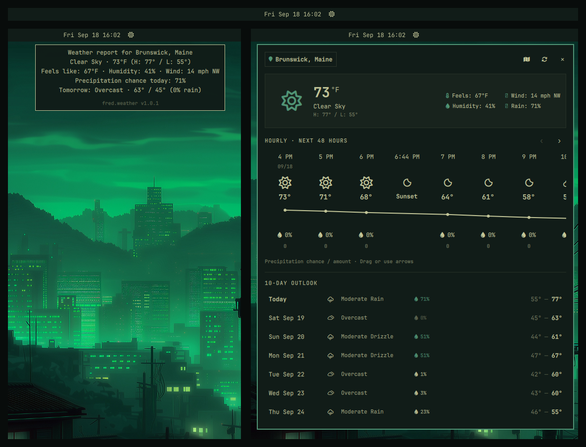

# fred.weather (`omarchy-fred-weather`)

A security-hardened, multi-monitor weather bar widget and popup panel for Omarchy Linux, replacing the stock `omarchy.weather` widget. Provides current conditions, a scrollable 48-hour timeline with temperature curve and solar markers, and an extended 10-day forecast.



| Attribute | Detail |
| :-- | :-- |
| **Plugin ID** | `fred.weather` |
| **Cloned From** | `omarchy.weather` |
| **License** | GPL-3.0-or-later |
| **Inspiration** | [`daniellopez12/just-right-weather`](https://github.com/daniellopez12/just-right-weather) |
| **Repository** | `greenermoose/omarchy-fred-weather` |
| **Author** | Fred (@greenermoose) |

---

## Features

- **Multi-Monitor Focus Isolation (Non-Modal Popout):**
  Unlike stock panels that create blocking overlay twins across all screens and steal keyboard focus, `fred.weather` binds its surface strictly to the host monitor and requests layershell keyboard focus only when its screen is active (`WlrLayershell.keyboardFocus: OnDemand`). You can keep full 48-hour forecasts and 10-day trends open on a secondary monitor while drafting emails or running terminal commands on your primary monitor without interruption.
- **Font Awesome Sun (`\uf185` / ``):**
  Replaces the stock monitor-brightness glyph (`\ue30d`) with a crisp, classic solar disc and flared rays from Font Awesome, rendered via the system's pre-installed JetBrainsMono Nerd Font.
- **At-a-Glance Bar Hover Tooltip:**
  Hovering over the bar widget instantly displays today's weather report for your city and state/province, current conditions, feels-like temperature, humidity, wind, rain chance, tomorrow's outlook, and widget version (`fred.weather v1.0.2`) at the bottom without expanding the panel.
- **48-Hour Scrollable Hourly Timeline:**
  Canvas-drawn temperature graph, precipitation probability (%) and rainfall volume, condition icons, and minute-precision chronological sunrise/sunset markers.
- **10-Day Extended Forecast:**
  Vertical card outlook displaying day, date, condition icon, high/low ranges, and precipitation chances.
- **Persistent Disk Cache:**
  Saves valid forecasts to `~/.cache/fred.weather/weather-cache.json` using atomic writes. Cold starts display cached weather immediately without waiting for network responses.
- **Security Baseline:**
  Executes network commands in a closed environment (`LANG=C`, `PATH=/usr/bin:/bin`) with strict curl timeouts (5s) and response buffer caps. Zero `npm` or `pip` runtime dependencies.

---

## Inspiration and Attribution

`fred.weather` is derived from the stock Omarchy weather plugin (MIT license) and draws architectural inspiration from Daniel Lopez's excellent [`just-right-weather`](https://github.com/daniellopez12/just-right-weather). 

Special thanks to Daniel Lopez for the 48-hour canvas curve implementation and chronological sunrise/sunset event integration. Visit the [just-right-weather repository](https://github.com/daniellopez12/just-right-weather) to compare implementations.

---

## Installation

```bash
omarchy plugin add https://github.com/greenermoose/weather-fred-tamlinux.git --enable
```

Because `fred.weather` declares `clonedFrom: "omarchy.weather"`, Omarchy automatically replaces the stock weather widget in your bar layout while preserving your layout anchors and notification routing.

### In-Place Layout Swap

In `~/.config/omarchy/shell.json`, replace `"omarchy.weather"` with `"fred.weather"`:

```json
{
  "bar": {
    "layout": {
      "center": [
        { "id": "omarchy.keyboard-layout" },
        { "id": "fred.weather" },
        { "id": "omarchy.system-update" }
      ]
    }
  }
}
```

---

## Usage

- **Left-Click Bar Icon:** Toggle the expanded weather panel.
- **Hover Bar Icon:** View the instant weather briefing and version tooltip.
- **Middle-Click Bar Icon:** Force an immediate weather refresh.
- **Right-Click Bar Icon:** Trigger the Omarchy weather desktop notification.
- **Click Location Label:** Open the search bar to search for a city, US ZIP code, or custom latitude/longitude coordinates.
- **Click Pin Map Icon:** Opens OpenStreetMap pin in your default browser using `xdg-open`.
- **Escape:** Closes the popup or cancels location search.
- **Tab / Shift+Tab:** Switch to adjacent bar panels.

---

## License

GPL-3.0-or-later. See [LICENSE](LICENSE) for details. Upstream Omarchy and Just Right Weather notices preserved in [UPSTREAM.md](UPSTREAM.md).
